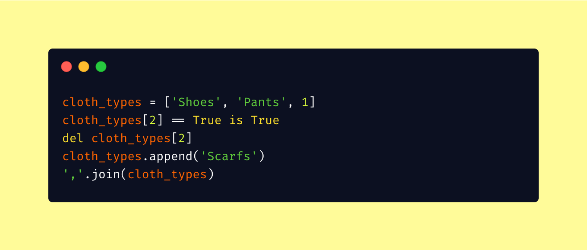

# assignment-2

<!--  carbon code -- can you guess what it does? Run and see the result!
cloth_types = ['Shoes', 'Pants', 1]
cloth_types[2] == True is True
del cloth_types[2]
cloth_types.append('Scarfs')
','.join(cloth_types) 
-->

Python data model practices.

You will be practicing python data types, objects, mutability, and object methods.

- Object
- Mutability
- Object methods
- Strings
- Int and float
- Sets
- Tuples
- Lists
- Dictionaries

Best of luck :smile:.
